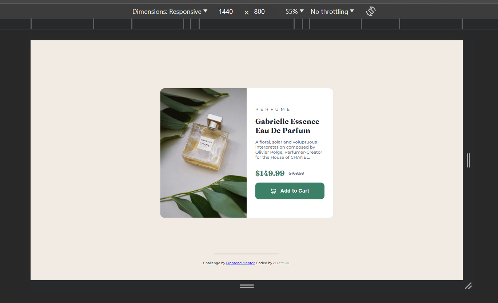
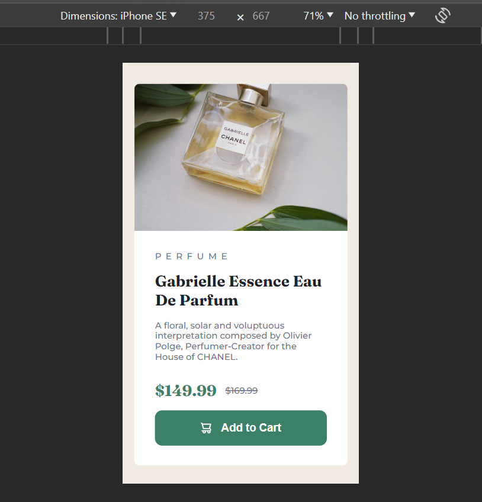

# Frontend Mentor - Product preview card component solution

This is a solution to the [Product preview card component challenge on Frontend Mentor](https://www.frontendmentor.io/challenges/product-preview-card-component-GO7UmttRfa). Frontend Mentor challenges help you improve your coding skills by building realistic projects. 

## Table of contents

- [Overview](#overview)
  - [The challenge](#the-challenge)
  - [Screenshot](#screenshot)
  - [Links](#links)
- [My process](#my-process)
  - [Built with](#built-with)
  - [What I learned](#what-i-learned)
  - [Continued development](#continued-development)
  - [Useful resources](#useful-resources)
- [Author](#author)


## Overview

The is the solution to the [Product preview card component challenge on Frontend Mentor], coded by clintt-09.

There are a total of two screenshots; the Desktop and Mobile views respectively. There are also links to the github repository and the live site hosted on netlify.

### The challenge

Users should be able to:

- View the optimal layout depending on their device's screen size
- See hover and focus states for interactive elements

### Screenshot

Desktop view (1440 x 800)




Mobile view (375 x 667)



### Links

- Solution URL: [Solution on frontendmentor.io](https://www.frontendmentor.io/solutions/responsive-preview-component-with-css-flexbox-and-media-queries-cD1DaJ1ydU)
- Live Site URL: [ace-1.netlify.app](https://ace-1.netlify.app/)

## My process

 Below are tools/ technologies I used to tackle this challenge, lessons that were learnt during the process of solving the problem, areas that I yearn to get better in the near future and articles that helped me and may help others to tackle this challenge(or Other ones) on Frontend Mentor.

  This is the Process I followed to tackle this challenge.

### Built with

- Semantic HTML5 markup
- CSS custom properties
- Flexbox
- CSS Media Queries

### What I learned

I gained a further understanding of CSS Media queries and have started using them with less difficulty. This challenge was fun and made me enjoy designing for Mobile/ Small Screen sizes.

There is a particular snippet I'm proud of:

```css
@media (max-width: 426px) {
    #desktop-pic{
        display: none;
    }

    #mobile-pic{
        display: inline-block;
        border-top-right-radius: 8.4448px;
        border-top-left-radius: 8.4448px;
        height: 35svh;
    }
}
```

It helps with switching images when the user views on Mobile or Desktop.

### Continued development

I believe I stil fall short when it comes to Responsive design. I am still learning to do this and I believe with more and more challenges solved, I will finally be able to design pages for any screen size without much trouble.

### Useful resources

- [MDN Web Docs](https://developer.mozilla.org/en-US/) - This is was a clear and concise documentation that helped me lots during this challenge. I believe every web developer is familiar with it but I still need to mention it in case.
- [A Complete Guide to CSS Media Queries by css-tricks](https://css-tricks.com/a-complete-guide-to-css-media-queries/) - This article helped me understand Media queiries to a decent degree and helped me make my solution Mobile friendly. I recommend to anyone struggling with Media queries.


## Author

- Frontend Mentor - [@clintt-09](https://www.frontendmentor.io/profile/clintt-09)
- Twitter - [@clinttfr](https://www.twitter.com/clinttfr)

